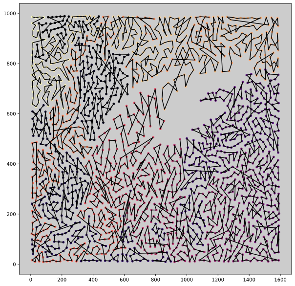

<!-- Improved compatibility of back to top link: See: https://github.com/othneildrew/Best-README-Template/pull/73 -->
<a name="readme-top"></a>
<!--
*** Thanks for checking out the Best-README-Template. If you have a suggestion
*** that would make this better, please fork the repo and create a pull request
*** or simply open an issue with the tag "enhancement".
*** Don't forget to give the project a star!
*** Thanks again! Now go create something AMAZING! :D
-->


<!-- PROJECT SHIELDS -->
<!--
*** I'm using markdown "reference style" links for readability.
*** Reference links are enclosed in brackets [ ] instead of parentheses ( ).
*** See the bottom of this document for the declaration of the reference variables
*** for contributors-url, forks-url, etc. This is an optional, concise syntax you may use.
*** https://www.markdownguide.org/basic-syntax/#reference-style-links
-->


[![LinkedIn][linkedin-shield]][linkedin-url]


<!-- PROJECT LOGO -->
<br />
<div align="center">
  <a href="https://github.com/tywilson5/PyStipple">
    
  </a>

<h3 align="center">PyStipple</h3>

  <p align="center">
    PyStipple is a powerful image manipulation tool that offers unique features for creating beautiful and customized results

    
  </p>
</div>


<!-- TABLE OF CONTENTS -->
<details>
  <summary>Table of Contents</summary>
  <ol>
    <li>
      <a href="#about-the-project">About The Project</a>
    </li>
    <li>
      <a href="#getting-started">Getting Started</a>
      <ul>
        <li><a href="#prerequisites">Prerequisites</a></li>
      </ul>
    </li>
    <li><a href="#usage">Usage</a></li>
    <li><a href="#license">License</a></li>
    <li><a href="#contact">Contact</a></li>
  </ol>
</details>


<!-- ABOUT THE PROJECT -->
## About The Project

![PyStipple Screen Shot][product-screenshot2]

Stipple Art: Transforms your images into stunning stipple art compositions, where the image is recreated using carefully placed dots.
Seam Removal: Seamlessly removes unwanted elements from your images, allowing you to refine their appearance.
Intelligent Resizing: Resizes images while preserving essential details, preventing the loss of important aspects of your photos.

<p align="right">(<a href="#readme-top">back to top</a>)</p>


<!-- GETTING STARTED -->
## Getting Started


### Prerequisites

This is an example of how to list things you need to use the software and how to install them.
* Requirements
  ```sh
  matplotlib==3.7.2
  numba==0.57.1
  numpy==1.24.3
  scipy==1.12.0
  skimage==0.0
  ```


<p align="right">(<a href="#readme-top">back to top</a>)</p>


<!-- USAGE EXAMPLES -->
## Usage
Simply initialize with the number of target points, Example shown in TSP.py and seams.py


1500 points:

![PyStipple Screen Shot][product-screenshot]

2000 points:

![PyStipple Screen Shot][product-screenshot2]

Seam Removal:

![PyStipple Screen Shot][product-screenshot3]


<p align="right">(<a href="#readme-top">back to top</a>)</p>


<!-- LICENSE -->
## License

Distributed under the Apache License. See `LICENSE.txt` for more information.

<p align="right">(<a href="#readme-top">back to top</a>)</p>


<!-- CONTACT -->
## Contact

Tyler Wilson - [@GitHub](https://github.com/tywilson5) - Tywilson@ursinus.edu

Project Link: [https://github.com/tywilson5/PyStipple](https://github.com/tywilson5/PyStipple)


<p align="right">(<a href="#readme-top">back to top</a>)</p>


<!-- MARKDOWN LINKS & IMAGES -->
<!-- https://www.markdownguide.org/basic-syntax/#reference-style-links -->
[contributors-shield]: https://img.shields.io/github/contributors/tywilson5/PyStipple.svg?style=for-the-badge
[contributors-url]: https://github.com/tywilson5/PyStipple/graphs/contributors
[forks-shield]: https://img.shields.io/github/forks/tywilson5/PyStipple.svg?style=for-the-badge
[forks-url]: https://github.com/tywilson5/PyStipple/network/members
[stars-shield]: https://img.shields.io/github/stars/tywilson5/PyStipple.svg?style=for-the-badge
[stars-url]: https://github.com/tywilson5/PyStipple/stargazers
[issues-shield]: https://img.shields.io/github/issues/tywilson5/PyStipple.svg?style=for-the-badge
[issues-url]: https://github.com/tywilson5/PyStipple/issues
[license-shield]: https://img.shields.io/github/license/tywilson5/PyStipple.svg?style=for-the-badge
[license-url]: https://github.com/tywilson5/PyStipple/blob/master/LICENSE.txt
[linkedin-shield]: https://img.shields.io/badge/-LinkedIn-black.svg?style=for-the-badge&logo=linkedin&colorB=555
[linkedin-url]: https://linkedin.com/in/tyler-wilson-261a95265
[product-screenshot]: images/shark.svg
[product-screenshot2]: images/penguins_stipple.png
[product-screenshot3]: images/penguin3.png
[Next.js]: https://img.shields.io/badge/next.js-000000?style=for-the-badge&logo=nextdotjs&logoColor=white
[Next-url]: https://nextjs.org/
[React.js]: https://img.shields.io/badge/React-20232A?style=for-the-badge&logo=react&logoColor=61DAFB
[React-url]: https://reactjs.org/
[Vue.js]: https://img.shields.io/badge/Vue.js-35495E?style=for-the-badge&logo=vuedotjs&logoColor=4FC08D
[Vue-url]: https://vuejs.org/
[Angular.io]: https://img.shields.io/badge/Angular-DD0031?style=for-the-badge&logo=angular&logoColor=white
[Angular-url]: https://angular.io/
[Svelte.dev]: https://img.shields.io/badge/Svelte-4A4A55?style=for-the-badge&logo=svelte&logoColor=FF3E00
[Svelte-url]: https://svelte.dev/
[Laravel.com]: https://img.shields.io/badge/Laravel-FF2D20?style=for-the-badge&logo=laravel&logoColor=white
[Laravel-url]: https://laravel.com
[Bootstrap.com]: https://img.shields.io/badge/Bootstrap-563D7C?style=for-the-badge&logo=bootstrap&logoColor=white
[Bootstrap-url]: https://getbootstrap.com
[JQuery.com]: https://img.shields.io/badge/jQuery-0769AD?style=for-the-badge&logo=jquery&logoColor=white
[JQuery-url]: https://jquery.com 